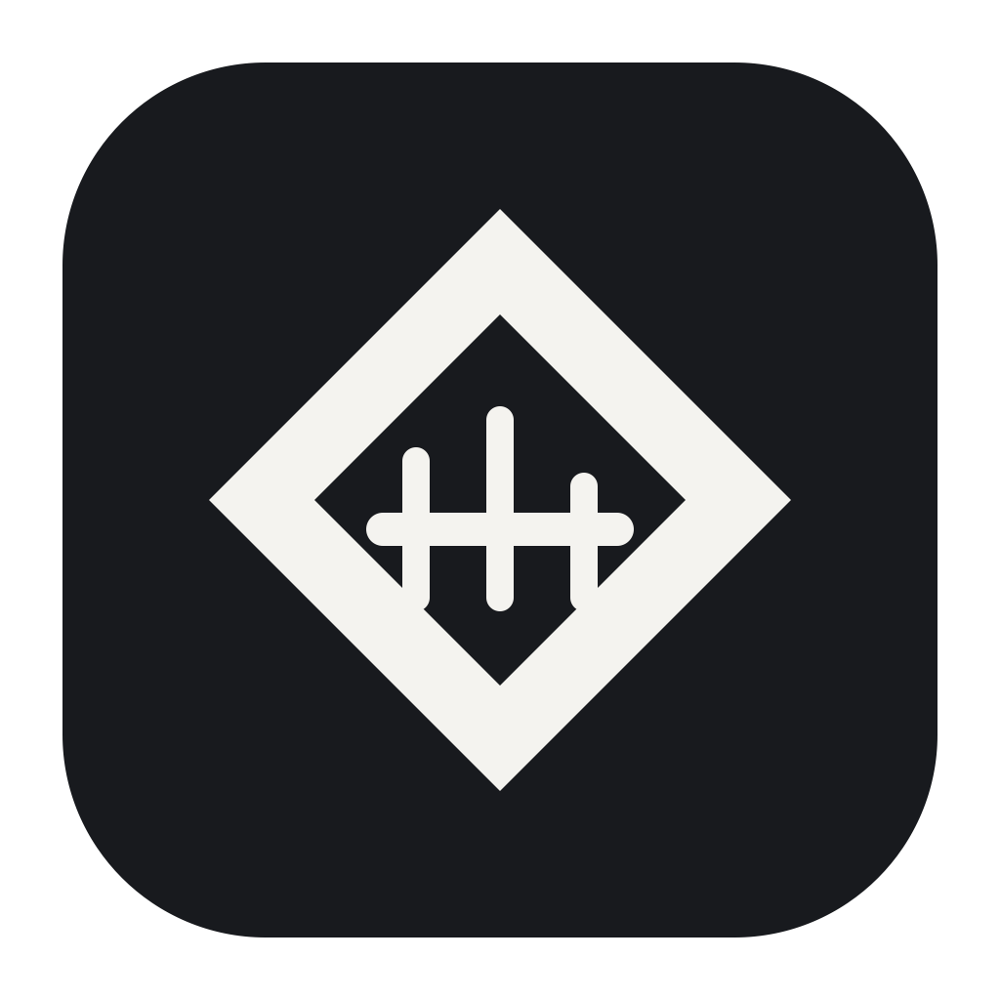

# CodexMeter ◈ — Know where your Codex tokens went.

> Local Codex token usage, always one click away in your macOS menu bar.

[](https://github.com/HechoLP/codex-meter/actions/workflows/ci.yml)


[](LICENSE)

<p align="center">
  
</p>

CodexMeter is a lightweight, native macOS menu bar app that turns locally observable Codex session history into clear token totals for today, this week, this month, and all locally available time. It needs no account login, API key, browser cookie, cloud sync, or telemetry.

## Why CodexMeter?

- **Glanceable totals.** See input, cached input, output, and total tokens without leaving the menu bar.
- **Honest accounting.** Cumulative token snapshots are normalized into increases instead of being naively added together.
- **Local by design.** Session history is parsed and summarized entirely on your Mac.
- **Native and quiet.** Built with Swift and SwiftUI, with no third-party runtime dependencies or background network traffic.

## Install

> [!IMPORTANT]
> CodexMeter is currently pre-release. A signed and notarized public download has not been published yet.

### Requirements

- macOS 14 Sonoma or later
- Xcode 26 or later with Swift 6.2
- Local Codex session history

### Build the current release candidate

```bash
git clone https://github.com/HechoLP/codex-meter.git
cd codex-meter
swift test
Scripts/release.sh
open "$(getconf DARWIN_USER_CACHE_DIR)/dev.codexmeter.release/CodexMeter.app"
```

The release script builds and verifies a Universal 2 app, then creates ZIP, DMG, and SHA-256 artifacts under `Artifacts/`. The local candidate is ad-hoc signed; Developer ID signing and Apple notarization are still required for public distribution.

Maintainers use `Scripts/release_public.sh` for the fail-closed Developer ID, notarization, stapling, and Gatekeeper path described in the [release guide](Documentation/RELEASING.md).

## First run

1. Launch CodexMeter after Codex has created local session history.
2. Select the diamond meter in the macOS menu bar.
3. Open **Settings** to control launch-at-login, refresh behavior, and local data.
4. Use **Refresh** whenever you want an immediate reconciliation.

No Codex account sign-in is required. CodexMeter reads only the supported local session directories on the current Mac.

## Features

- Today, week, month, and locally observable all-time periods
- Input, cached input, output, and total-token breakdowns
- File-event hints plus periodic and manual refresh
- Incremental JSONL ingestion with transactional SQLite checkpoints
- Duplicate, replay, incomplete-line, and file-truncation safeguards
- Native menu bar popover and Settings window
- Optional launch at login through macOS Service Management
- Local history clearing with secure deletion and a re-import cutoff
- Opt-in operational diagnostics that exclude sensitive content and paths
- No notifications, advertisements, analytics, or cloud account

## How counting works

```text
Codex session JSONL
  → contained source discovery
  → bounded incremental reader
  → cumulative snapshot normalization
  → transactional SQLite storage
  → menu bar totals
```

Codex token-count events are cumulative snapshots. CodexMeter derives component-wise increases and ignores repeated snapshots. Cached input is shown separately but is not added to the total twice: total tokens remain input plus output, while cached input is a subset of input.

> [!NOTE]
> CodexMeter does not use an official account-usage API. **All Time** means the oldest token record still available in local Codex session history through now. Deleted logs and activity on other Macs may not be represented.

## Privacy note

CodexMeter performs no network requests. It discovers JSONL files only inside:

- `~/.codex/sessions`
- `~/.codex/archived_sessions`

It stores normalized token counts, timestamps, SHA-256-derived session/source/event identifiers, and parser checkpoints. It does **not** store or log raw session paths, prompts, responses, reasoning text, source code, tool input or output, terminal output, model names, project working directories, authentication tokens, or `~/.codex/auth.json`.

The Application Support directory is restricted to the current user (`0700`), and SQLite files are restricted to the current user (`0600`). See the full [privacy design](Documentation/PRIVACY.md).

## macOS permissions

| Capability | Required? | Why |
| --- | :---: | --- |
| Full Disk Access | No | CodexMeter reads only known files under `~/.codex`. |
| Accessibility | No | It does not control other apps. |
| Screen Recording | No | It does not inspect the screen. |
| Keychain access | No | It does not read Codex credentials. |
| Launch at Login approval | Optional | Needed only when you enable automatic launch. |

## Development

Run the test suite and development build:

```bash
swift test
swift run CodexMeter
```

Build the same Universal 2 configuration used by CI:

```bash
swift build -c release --arch arm64 --arch x86_64
```

CodexMeter targets macOS 14 and Swift 6.2. The codebase uses AppKit, SwiftUI, Core Services, Service Management, and the system SQLite library.

## Documentation

- [Architecture](Documentation/ARCHITECTURE.md) — ingestion, normalization, storage, and UI flow
- [Privacy](Documentation/PRIVACY.md) — data boundaries, file permissions, and deletion behavior
- [Troubleshooting](Documentation/TROUBLESHOOTING.md) — common local issues and safe recovery steps
- [Releasing](Documentation/RELEASING.md) — signing, notarization, packaging, and rollback
- [Changelog](CHANGELOG.md) — version history
- [Contributing](CONTRIBUTING.md) — development and contribution workflow
- [Security](SECURITY.md) — vulnerability reporting

## Project status

The current version is `0.1.0` and remains pre-release. CI builds and tests the app on macOS, including the Universal 2 release configuration. Public distribution remains gated on Developer ID signing, notarization, and a final independent release audit.

## Acknowledgements

README presentation inspired by [CodexBar](https://github.com/steipete/CodexBar). CodexMeter is an independent implementation focused on local Codex token accounting.

## Disclaimer

CodexMeter is an unofficial utility and is not affiliated with or endorsed by OpenAI. Codex is a trademark of OpenAI.

## License

CodexMeter is available under the [MIT License](LICENSE).
