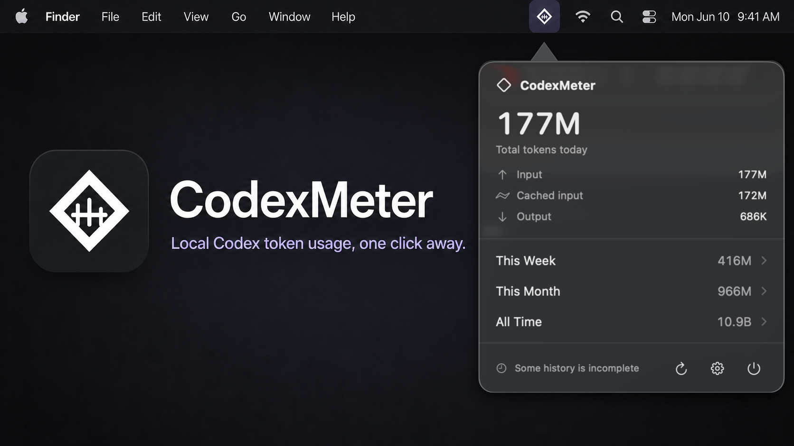

# CodexMeter ◈ — Know where your Codex tokens went.

> Local Codex token usage, always one click away on macOS and Windows.

[](https://github.com/HechoLP/CodexMeter/actions/workflows/ci.yml)
[](https://support.apple.com/macos)
[](Documentation/WINDOWS.md)
[](Documentation/ReleaseNotes/0.1.1.md)
[](Documentation/ReleaseNotes/windows-0.1.0.md)
[](Package.swift)
[](LICENSE)



<p align="center"><sub>The app popover shown above is an actual CodexMeter screen.</sub></p>

Tiny native macOS menu bar and Windows notification-area apps that turn **local Codex session history** into clear token totals. Today, this week, this month, and all locally available time stay one click away—without an account login, API key, browser cookie, telemetry, or cloud sync.

## Why

- **Glanceable totals.** See input, cached input, output, and total tokens without leaving the menu bar.
- **Honest accounting.** Cumulative snapshots are normalized into increases instead of being added repeatedly.
- **Local by design.** Prompts, responses, source code, credentials, and raw session paths are not stored in CodexMeter's database.
- **Native and quiet.** SwiftUI on macOS, WPF on Windows, no Dock/taskbar window, and no telemetry.

## Install

### macOS requirements

- macOS 14 Sonoma or later
- Local Codex session history under `~/.codex`

### Direct download

CodexMeter v0.1.1 is available as a certificate-free Universal 2 DMG and ZIP. The app uses an ad-hoc signature rather than an Apple Developer ID certificate, so macOS will not trust the first launch automatically. Verify the downloaded DMG and follow the one-time first-run steps below.

This is an unnotarized preview, not an Apple-trusted release. Sparkle update archives and the update feed are separately authenticated with Ed25519 signatures, while first-install trust is established by checking the published SHA-256 manifest.

### macOS에서 미공증 프리뷰를 처음 실행할 때

미공증 프리뷰를 테스트해야 한다면 공식 GitHub 릴리스에서 DMG와 `SHA256SUMS.txt`를 같은 폴더에 받은 뒤, 먼저 체크섬을 확인하세요. 다음 명령이 `OK`를 출력하지 않으면 앱을 실행하지 마세요.

```bash
cd ~/Downloads
grep ' CodexMeter-0.1.1.dmg$' SHA256SUMS.txt | shasum -a 256 -c -
open CodexMeter-0.1.1.dmg
```

열린 DMG에서 `CodexMeter.app`을 `Applications` 폴더로 복사합니다. 체크섬이 일치하고 공식 릴리스임을 확인한 경우에만 아래 명령으로 해당 앱의 격리 속성을 제거하고 실행하세요.

```bash
xattr -dr com.apple.quarantine /Applications/CodexMeter.app
open /Applications/CodexMeter.app
```

`xattr` 명령은 이 앱에 대한 macOS의 다운로드 격리 검사를 제거합니다. 출처가 다르거나 체크섬이 일치하지 않는 파일에는 사용하지 마세요. Developer ID 서명과 Apple 공증을 마친 정식 릴리스에서는 이 단계가 필요하지 않습니다.

### Windows portable preview

Windows 10/11 users can download the x64 or ARM64 portable ZIP from the [`windows-v0.1.0` release](https://github.com/HechoLP/CodexMeter/releases/tag/windows-v0.1.0). The package is self-contained, so a separate .NET installation is not required.

Verify the ZIP against `SHA256SUMS-windows.txt`, extract it to a permanent folder, and run `CodexMeter.exe`. This preview is not code-signed, so Windows SmartScreen may require **Properties → Unblock** or the following command after the hash is confirmed:

```powershell
Unblock-File .\CodexMeter.exe
Start-Process .\CodexMeter.exe
```

See the complete [Windows installation and build guide](Documentation/WINDOWS.md).

## First run

1. Launch CodexMeter after Codex has created local session history.
2. Select the diamond meter in the macOS menu bar or Windows notification area.
3. Open **Settings** to choose the displayed period, refresh mode, menu bar elements, and launch-at-login behavior.
4. Use **Refresh** whenever you want an immediate reconciliation.

No Codex account sign-in is required.

## Features

- Today, week, month, and locally observable all-time totals
- Input, cached input, output, and total-token breakdowns
- Automatic file-event refresh with a lightweight configurable fallback
- Manual, 30-second, one-minute, and five-minute refresh modes
- Bounded incremental JSONL ingestion on macOS and a changed-file memory cache on Windows
- Duplicate, replay, partial-line, truncation, and same-inode rewrite protection
- Resumable 32 MiB / roughly five-second import slices for large histories
- Native menu bar/notification-area popover and Settings window
- Optional launch at login through macOS Service Management or the current-user Windows startup key
- Daily signed update checks on macOS and a manually opened release page on Windows
- Secure local-history clearing with a persistent re-import cutoff
- No notifications, advertising, analytics, or cloud account

## How token counting works

```text
Codex session JSONL
  → contained source discovery
  → bounded incremental reader
  → cumulative snapshot normalization
  → local normalized event cache
  → menu bar or notification-area totals
```

Codex token-count events are cumulative snapshots. CodexMeter derives component-wise increases and ignores repeated snapshots. Cached input is a subset of input and is never added twice:

```text
Total = Input + Output
Cached Input ⊆ Input
```

## Data sources

CodexMeter reads JSONL files only inside:

- `~/.codex/sessions`
- `~/.codex/archived_sessions`
- `%USERPROFILE%\.codex\sessions` on Windows
- `%USERPROFILE%\.codex\archived_sessions` on Windows

It does not use an official account-usage API and does not scan unrelated folders.

## Accuracy and limitations

- **All Time** means the oldest token record still present in local Codex session history through now.
- Deleted logs cannot be reconstructed.
- Activity from another computer is not included unless its session history exists locally.
- A future Codex session-schema change may require a CodexMeter update.
- Ambiguous counter baselines and malformed records are reported as partial rather than guessed.

## Roadmap

Codex is the first supported data source. Future releases are planned to expand CodexMeter into a multi-service local usage meter, including **Claude** and other AI coding assistants where reliable local usage data is available. Support will be added service by service while preserving CodexMeter's local-first privacy model.

## Privacy

CodexMeter processes usage entirely on-device. The macOS build can check a signed Sparkle update feed; the Windows build opens GitHub Releases only when requested. Neither platform attaches token totals, prompts, source paths, credentials, or local cache contents. CodexMeter does **not** store or log prompts, responses, reasoning text, source code, tool input or output, terminal output, raw session paths, model names, project paths, authentication tokens, or `.codex/auth.json`.

The Application Support directory is owner-only (`0700`); the SQLite database, lock, and fingerprint-key files are owner-only (`0600`). See [Privacy](Documentation/PRIVACY.md) for the complete boundary.

## Platform permissions

| Capability | macOS | Windows | Why |
| --- | :---: | :---: | --- |
| Full Disk Access | No | N/A | Reads only supported files under `.codex`. |
| Accessibility | No | No | Does not control other apps. |
| Screen Recording | No | No | Does not inspect the screen. |
| Codex credential access | No | No | Does not read Codex authentication data. |
| Launch at Login | Optional | Optional | Enabled only by the user in Settings. |

## Settings

| Pane | Controls |
| --- | --- |
| General | Launch at Login, refresh mode, week start, and macOS automatic updates |
| Appearance | Period, metric, number style, icon/text visibility, popover details |
| Usage | Accounting semantics and cached-input explanation |
| Data | Source status, database statistics, rebuild, clear history |
| Advanced | Privacy-safe diagnostics and log folder |

## Build from source

```bash
git clone https://github.com/HechoLP/CodexMeter.git
cd CodexMeter
swift test
swift run CodexMeter
```

Build and verify a certificate-free Universal 2 preview:

```bash
Scripts/release_unsigned.sh
```

This produces an ad-hoc-signed ZIP, DMG, per-file checksums, and `SHA256SUMS.txt` without using an Apple certificate. Maintainers who later add a Developer ID Application certificate and notarization profile can use the Apple-trusted workflow:

```bash
export CODE_SIGN_IDENTITY="Developer ID Application: Your Name (TEAMID)"
export CODE_SIGN_TEAM_ID="TEAMID"
export NOTARY_PROFILE="codexmeter-notary"
Scripts/release_public.sh
```

Build and test the Windows version with the .NET 8 SDK:

```powershell
dotnet restore .\Windows\CodexMeter.Windows.sln
dotnet test .\Windows\CodexMeter.Windows.sln --configuration Release
.\Windows\Scripts\package.ps1 -RuntimeIdentifier win-x64 -ResetManifest
```

## Troubleshooting

- **No usage found:** launch Codex at least once and check that `~/.codex/sessions` contains JSONL files.
- **Statistics look incomplete:** use **Settings → Data → Rebuild Statistics**.
- **Launch at Login is blocked:** open macOS **System Settings → General → Login Items**.
- **Database safety limit reached:** review the local totals, then use **Clear Local History** if they are no longer needed.

See the complete [Troubleshooting guide](Documentation/TROUBLESHOOTING.md).

## Documentation

- [Architecture](Documentation/ARCHITECTURE.md)
- [Privacy](Documentation/PRIVACY.md)
- [Releasing](Documentation/RELEASING.md)
- [Troubleshooting](Documentation/TROUBLESHOOTING.md)
- [Changelog](CHANGELOG.md)
- [Contributing](CONTRIBUTING.md)
- [Security](SECURITY.md)

## Acknowledgements

README presentation inspired by [CodexBar](https://github.com/steipete/CodexBar). Automatic updates use [Sparkle](https://sparkle-project.org/). CodexMeter is an independent implementation focused on local Codex token accounting.

## Disclaimer

CodexMeter is an unofficial utility and is not affiliated with or endorsed by OpenAI. Codex is a trademark of OpenAI.

## License

MIT © CodexMeter contributors. See [LICENSE](LICENSE).
